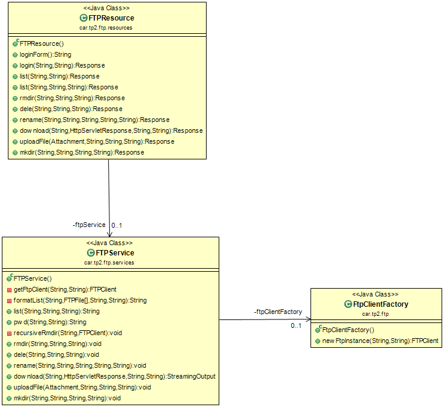

# Rendu TP Gateway-FTP
Réalisé par Louis GUILBERT et Jonathan LECOINTE

13/03/2017

---

## Introduction
Ce logiciel est une passerelle HTTP permettant de se connecter à un serveur FTP.
Cela permet de gérer toutes les fonctionnalités d'un serveur FTP en réalisant
de simples requêtes HTTP GET ou POST.


### Executer le serveur
Exemple de commande :
```
mvn exec:java -Dftp.port=2020 -Dftp.host=ftp.univ-lille1.fr -Dftp.mode=actif -Dserver.port=8080
```
* -Dftp.host précise l'adresse de la machine sur laquelle se trouve le serveur FTP
* -Dftp.port précise le port sur lequel se connecter au serveur FTP
* -Dftp.mode précise le mode actif ou passif (au sens FTP)
* -Dserver.port précise le port sur lequel la passerelle écoutera les requêtes HTTP


### Executer les tests
Notre démarche a été de réaliser des tests qui effectuent des requêtes HTTP
vers notre passerelle et analyse les retours de celle-ci.

De part la structure même du projet, il n'a pas été possible de lancer les tests
simplement avec maven. D'abord, il faut que le serveur soit démarré pour que les
tests puissent être effectués. Ensuite, pour une raison inconnue, la commande
`mvn test` ne détecte pas les tests que nous avons effectués, et donc ne les
exécute pas. Nous avons tenté de nombreuses démarches pour réaliser des tests
corrects (mock du clientFTP, lancement du serveur depuis les tests...), mais avons rencontré des difficultés dues au sujet même du TP, aux contraintes du framework
utilisé et au peu de temps disponible pour réaliser cette tâche.

Nous avons donc du procéder à certaines adaptations :
* Nous avons installé la librairie _FakeFTPServer_ qui est en fait un mock de
serveur FTP. C'est sur celui-ci que se connectera le client FTP de notre client
lors des tests
* Nous avons mis en place un mode _test_ sur la passerelle, c'est lorsque l'on
active ce mode que le client FTP se connecte au FakeFTPServer

La marche à suivre est donc la suivante pour tester le projet :

```
mvn exec:java -Dexec.args="test"
```
Puis, il faut lancer les tests depuis eclipse grâce à jUnit.

NB: pour le test _testDeleSuccess_, il ne fonctionne qu'à la première exécution.
En effet, l'idée de départ était de créer un fichier grâce à FakeFTPServer, puis
de le supprimer dans le test. Ceci n'a finalement pas été possible, car le serveur
et les tests étant lancés séparément, ils ne partagent pas la même mémoire, le code
des tests ne peut donc pas modifier l'état du _FakeFTPServer_. Nous avons donc du créer un fichier avant le lancement du serveur. Ceci fait que le test fonctionne au premier lancement, mais ne fonctionne plus ensuite car le fichier est déjà supprimé.


## Architecture
### Fonctionnalités

Nous avons réalisé toutes les fonctionnalités attendues en dehors du téléchargement
de dossiers.


### Architecture en deux couches
Nous avons réalisé deux couches pour gérer les requêtes sur notre serveur :

* La couche _Controller_, qui reçoit les requêtes et formate les résultats de
celles-ci, est représentée par la classe `FtpResource`.
* La couche _Service_, qui exécute les actions nécessaires aux requêtes, est
représentée par la classe `FtpService`.

De cette manière, le controlleur n'a pas connaissance du client FTP, puisqu'il n'a pas besoin de réaliser les requêtes lui même. Cette séparation du code en couches permet d'avoir un code beaucoup plus clair et maintenable.



### Les requêtes
Notre passerelle propose deux types de requêtes : GET et POST.

Nous n'avons supporté que ces deux verbes, car nous utilisons une version très
simple de client, avec uniquement du HTML.

Les requêtes GET sont réalisées grâce à des liens de type <a>, et les requêtes
POST grâce à des formulaires.

### Connexion
Pour conserver notre passerelle en mode _stateless_, nous avons décidé de recréer
un nouveau client FTP à chaque requête du client. Pour se faire, celui-ci renvoie
ses identifiants à chacune de ses requêtes, et une nouvelle connexion au serveur
FTP est réalisée grâce à ceux-ci.

### Gestion des exceptions
Dans ce programme, il y a deux cas lors desquels nous devons gérer des
exceptions:

* Les erreurs des requêtes

Certaines requêtes peuvent ne pas fonctionner. Par exemple, si le client demande de
supprimer un dossier qui n'existe pas, on ne pourra pas satisfaire sa requête.

Dans ce cas, le service retourne une exception de type `FtpRequestException` qui
contient le code erreur (en général 500), et éventuellement une chaine précisant
la nature de l'erreur.

* Les erreurs d'exécution

Autre cas, des requêtes peuvent provoquer des erreurs à l'exécution. Par exemple,
l'ouverture d'un fichier peut parfois provoquer une _IOException_. Lorsque de telles
erreurs surviennt, le service retourne une exception de type `FtpRequestException` qui
contient le code erreur (en général 500), et éventuellement une chaine précisant
la nature de l'erreur.


### Code Samples
* Design Pattern Factory

A chaque requête du client nous devons créer un nouveau client FTP. Le code requis
pour cette action est assez lourd et demande beaucoup de traitement.

Pour simplifier cette gestion, nous avons réalisé une _Factory_ qui permet de
créer un client FTP très facilement et qui limite un maximum le code en dehors
de cette classe pour gérer ce client.

```

public class FtpClientFactory {

	/**
	 * Crée un ftpClient
	 * @param username nom d'utilisateur ftp
	 * @param password mot de passe ftp
	 * @return l'instance du client ftp
	 * @throws ConnectException l'erreur en cas d'erreur de connexion
	 */
	public FTPClient newFtpInstance(final String username, final String password) throws ConnectException {
		final FTPClient client = new FTPClient();
		try {
			final String host = Constants.get("ftpHost");
			final int port = Integer.parseInt(Constants.get("ftpPort"));

			client.connect(host, port);
			final int reply = client.getReplyCode();
			if(!FTPReply.isPositiveCompletion(reply)) {
		        client.disconnect();
		        return null;
			}

			if(Constants.get("ftpMode").equals("actif")) {
				client.enterLocalActiveMode();
			} else {
				client.enterLocalPassiveMode();
			}

			if (client.login(username, password)) {
				return client;
			} else {
				return null;
			}
		} catch (final SocketException e) {
			throw new ConnectException("Impossible de se connecter au serveur ftp");
		} catch (final IOException e) {
			throw new ConnectException("Impossible de se connecter au serveur ftp");
		}
	}
}
```

* Suppression récursive de dossiers

Pour supprimer un dossier en FTP, il faut d'abord supprimer tous les fichiers
contenus dans ce dossier, puis supprimer le dossier en lui-même.
Nous avons donc réalisé un algorithme récursif :

```
  private void recursiveRmdir(final String path, final FTPClient ftpClient) throws IOException, FtpRequestException {
		final FTPFile[] files = ftpClient.listFiles(path);
		for(final FTPFile f : files) {
			if(f.isDirectory()) {
				recursiveRmdir(path + "/" + f.getName(), ftpClient);
			} else {
				if (ftpClient.dele(path + "/" + f.getName()) == 550) {
					throw new FtpRequestException(500);
				}
			}
		}
		if (ftpClient.rmd(path) == 550) {
			throw new FtpRequestException(500);
		}
	}
```


* Framework de tests

Pour les tests unitaires, nous n'avons pas simplement testé les fonction en les
appellant depuis nos tests. Nous avons utilisé le framework `Rest Assured`, qui
permet de tester les ressources du serveur en effectuant des requêtes, puis en
analysant le résultat de manière très élégante :

```
@Test
	public void testList() {
		given().
			queryParam("username", user).
			queryParam("password", pass).
		expect().
			statusCode(200).
			body(containsString("testfile100")).
			body(containsString("testfolder")).
		when().
			get("list");
	}
```

Ici, nous vérifions que lorsque l'on fait une requête /list, en donnant les paramètres
username et password, on obtient bien un statut 200, et le résultat contient
les fichiers "testfile100" et "testfolder".

L'écriture des tests est très élégante et facile avec ce framework, et il nous
a semblé intéressant de mettre ce système en avant.
